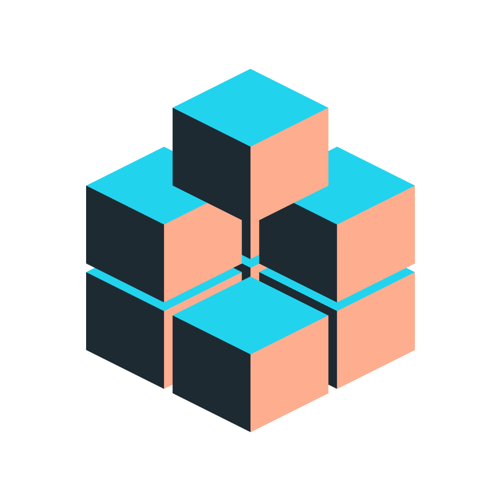
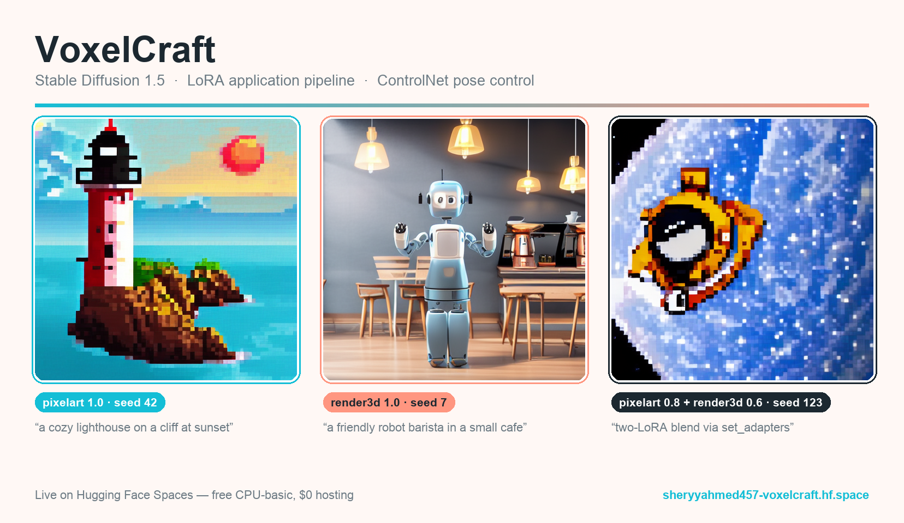
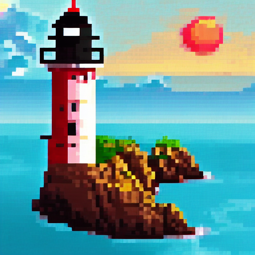
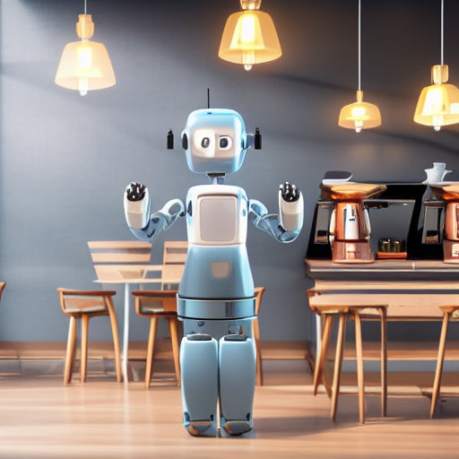
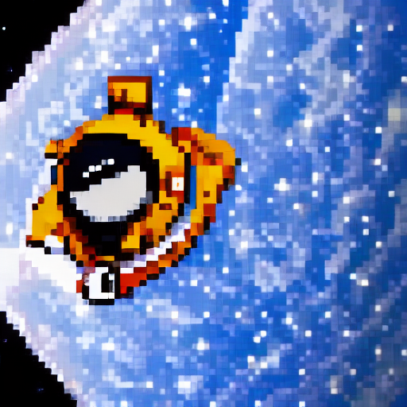

<p align="center">
  
</p>

<h1 align="center">VoxelCraft</h1>

<p align="center">
  <em>Stable Diffusion 1.5 LoRA application pipeline · ControlNet pose control</em>
</p>

<p align="center">
  <a href="https://sheryyahmed457-voxelcraft.hf.space"><b>Live demo</b></a> ·
  <a href="https://voxelcraft-showcase.vercel.app"><b>Showcase</b></a> ·
  <a href="https://github.com/sheharyarr-ahmed/voxelcraft"><b>Source</b></a>
</p>

<p align="center">
  <a href="https://sheryyahmed457-voxelcraft.hf.space">
    
  </a>
</p>

A Stable Diffusion 1.5 **LoRA application** pipeline with ControlNet pose control, built on
Diffusers and served with Gradio on Hugging Face Spaces. Enter a prompt, stack up to two
pre-trained LoRAs with per-adapter weight control, or drive generation from a reference pose —
every result comes with a metadata panel showing exactly what was applied.

**Live demo:** https://sheryyahmed457-voxelcraft.hf.space · **Source:** https://github.com/sheharyarr-ahmed/voxelcraft

## What this is / What this is not

This section is deliberate and load-bearing. It states exactly where hands-on work ends.

**What this is:**

- A **LoRA application** pipeline — loading pre-trained `.safetensors` adapters via Diffusers
  `load_lora_weights`, stacking up to two with `set_adapters`, and blending them at per-adapter
  weights from 0.0 to 1.5.
- **ControlNet integration** for pose-controlled generation — OpenPose skeleton extraction from
  a reference photo, then pose-conditioned generation.
- **Diffusers production patterns** — lazy model loading, fp16/fp32 device policy, attention
  slicing, device detection, and typed error handling at every boundary.
- A **Hugging Face Spaces deployment** workflow, from Gradio Blocks UI to ZeroGPU.
- A **documented** LoRA training methodology reference (`docs/LORA_TRAINING.md`).

**What this is not:**

- **Not custom LoRA training.** No model was trained by the author on custom data; there is no
  GPU training pipeline here. The Colab notebook under `notebooks/` is a methodology *reference*,
  explicitly not executed by the author on custom data.
- **Not SDXL** — SD 1.5 only, chosen to fit the free ZeroGPU / CPU-basic memory envelope.
- **Not** img2img, inpainting, video, batch generation, user accounts, result persistence, a
  programmatic API, or a mobile client. These are deliberate scope exclusions, not omissions.

## Features

1. **Text to image with LoRA stacking.** Prompt in, select 1–2 license-verified LoRAs from the
   registry, adjust weight sliders, generate a 512×512 image. A metadata panel reports the LoRAs
   applied, weights, seed, scheduler, steps, and inference time. Two license-verified LoRAs ship
   today — `pixelart` and `render3d` — stackable and individually weighted.
2. **Pose-controlled generation.** Upload a reference photo; OpenPose extracts the skeleton
   (shown as intermediate output); ControlNet + SD 1.5 (+ an optional LoRA style) generate a new
   image matching the pose.
3. **Training methodology reference.** A static tab rendering the LoRA training walkthrough, with
   the banner: _"Methodology reference. This app applies pre-trained LoRAs."_

## Examples

Real outputs generated through the app on the live Space (free CPU-basic, SD 1.5, DPM++ 2M,
20 steps). Each image's seed, LoRAs, and inference time came from the app's own metadata panel.

<table>
<tr>
<td width="33%"></td>
<td width="33%"></td>
<td width="33%"></td>
</tr>
<tr>
<td><b><code>pixelart</code></b> @ 1.0 · seed 42<br><sub>"a cozy lighthouse on a cliff at sunset"</sub></td>
<td><b><code>render3d</code></b> @ 1.0 · seed 7<br><sub>"a friendly robot barista in a small cafe"</sub></td>
<td><b><code>pixelart</code></b> @ 0.8 + <b><code>render3d</code></b> @ 0.6 · seed 123<br><sub>two-LoRA blend via <code>set_adapters</code></sub></td>
</tr>
</table>

## Architecture

Validated Pydantic request → lazy SD 1.5 singleton → LoRA manager → seeded DPM++ 2M denoise →
VAE decode → safety checker → image + metadata. The ControlNet pipeline is composed from the base
pipeline's components (`from_pipe`) so the UNet, VAE, and text encoder are shared, not duplicated.
See [`docs/ARCHITECTURE.md`](docs/ARCHITECTURE.md) for the full diagram and the decision rationale.

## Model licenses

Every model artifact loaded at runtime is documented. Base and conditioning models:

| Artifact | Model ID | Author | License |
| --- | --- | --- | --- |
| SD 1.5 base weights | `stable-diffusion-v1-5/stable-diffusion-v1-5` | Stability AI / RunwayML | CreativeML Open RAIL-M (use-based restrictions apply) |
| ControlNet OpenPose | `lllyasviel/control_v11p_sd15_openpose` | lllyasviel | Open RAIL |
| OpenPose annotator | `lllyasviel/Annotators` | lllyasviel | Unspecified — verify per the ambiguity rule before use |
| LoRA — `pixelart` | `artificialguybr/pixelartredmond-1-5v-pixel-art-loras-for-sd-1-5` | artificialguybr | bespoke-lora-trained-license — commercial image use permitted (verified 2026-07-05) |
| LoRA — `render3d` | `artificialguybr/3d-redmond-1-5v-3d-render-style-for-liberte-redmond-sd-1-5` | artificialguybr | bespoke-lora-trained-license — commercial image use permitted (verified 2026-07-05) |

LoRA adapters are pre-trained, third-party models. Each is added to the registry
(`src/config.py`) only after its commercial-use license is verified by hand — the registry records
the model-card URL, author, exact license/permission wording, and date checked. Both registered
LoRAs are authored by artificialguybr under a bespoke-lora-trained-license whose terms permit
selling generated images and running paid generation services, while disallowing resale of the
model itself (which this app does not do).

## Run locally

```bash
python3.12 -m venv venv
venv/bin/pip install -r requirements.txt
# Pre-download the SD 1.5 weights once (first generation is a multi-GB download):
venv/bin/python -m src.pipelines.sd_pipeline
venv/bin/python app.py
```

Note on memory: end-to-end generation needs roughly 6 GB of free RAM (or a GPU). On an 8 GB
machine the CPU fp32 decode can exhaust memory; the hosted Space is the intended way to generate
images. Development, tests, and type checks run comfortably on 8 GB.

Development checks:

```bash
venv/bin/pip install -r requirements-dev.txt
venv/bin/pytest -q
venv/bin/mypy --strict src
venv/bin/black --check --line-length 100 src tests app.py
```

## Tech stack

Python 3.12 · Diffusers · Transformers · PyTorch · PEFT · controlnet-aux · Pydantic v2 · Gradio ·
Hugging Face Spaces (free CPU-basic; `@spaces.GPU`-wired for ZeroGPU should PRO ever be added).
Single-author history is enforced mechanically by a `commit-msg` git hook.

## License

MIT — see [`LICENSE`](LICENSE). This covers the VoxelCraft application code only; the models it
loads carry their own licenses, documented above.
