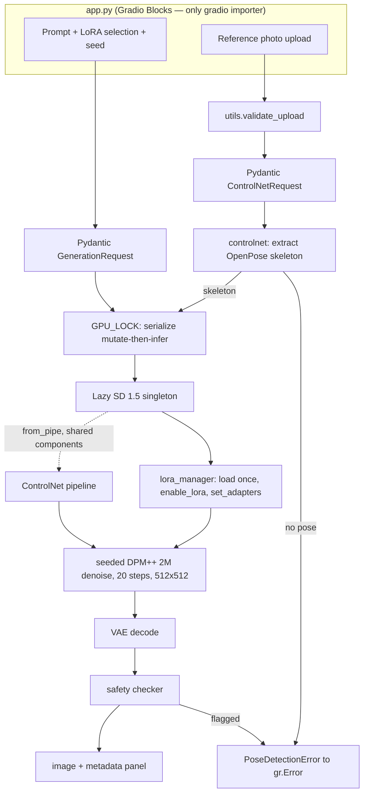

# Architecture

VoxelCraft is a thin Gradio UI over a small, strictly-bounded pipeline layer. The design rules
are enforced structurally: `src/` never imports gradio, nothing loads a model at import time, and
every user input crosses a Pydantic boundary before reaching a pipeline.

## Generation pipeline

## Module boundaries

| Module | Responsibility | Never imports |
| --- | --- | --- |
| `src/config.py` | Pinned model IDs, bounds, `LoraEntry`, registry | torch, pydantic |
| `src/schemas.py` | Pydantic v2 request validation (D6) | torch, gradio |
| `src/utils.py` | Upload validation, seed, token overflow, metadata | torch, gradio |
| `src/exceptions.py` | Typed `VoxelCraftError` hierarchy | everything |
| `src/pipelines/sd_pipeline.py` | Lazy SD 1.5 singleton, generation, device policy | gradio |
| `src/pipelines/lora_manager.py` | Adapter load/stack/weight state machine | gradio |
| `src/pipelines/controlnet_processor.py` | OpenPose extraction, ControlNet composition | gradio |
| `app.py` | Gradio Blocks UI, error mapping | — (sole gradio importer) |

The `src/` → gradio import ban means pipeline code raises typed exceptions
(`PipelineLoadError`, `LoraLoadError`, `GenerationError`, `PoseDetectionError`,
`UploadValidationError`); only `app.py` catches `VoxelCraftError` and maps it to a one-sentence
`gr.Error`. A test asserts the config/schema/utils layer imports without pulling in torch, keeping
the unit suite and the Stop-hook gate fast.

## Key decisions

Full rationale and rejected alternatives live in
[`.claude/agents/meta/decisions.md`](../.claude/agents/meta/decisions.md); a summary:

- **SD 1.5, not SDXL (D2)** — fits the free ZeroGPU / CPU-basic memory envelope; SDXL risks OOM.
- **Lazy singletons (D7)** — models load on first generation, not at import; imports stay instant.
- **fp16 on CUDA, fp32 on MPS/CPU (D8)** — fp16 on MPS yields black/NaN images on SD 1.5.
- **`enable_lora()` before `set_adapters()`** — after any `disable_lora()`, `set_adapters()` alone
  does not re-enable, which would silently generate with no LoRA effect. Verified against the
  installed Diffusers source.
- **ControlNet via `from_pipe`** — shares the base UNet/VAE/text-encoder by reference rather than
  loading a second copy.
- **DPM++ 2M at 20 steps (A10)** — comparable quality to the checkpoint-default PNDM@50 at roughly
  half the wall-clock, which matters on the CPU-basic fallback.
- **Shared `GPU_LOCK`** — text-to-image and pose generation serialize on one lock so two requests
  never interleave LoRA state or both hold a full model resident.
- **Manual license verification (D4)** — a LoRA enters the registry only after its commercial-use
  license is confirmed by hand; tooling never sets `commercial_use=True`.

## Validation and error flow

Raw widget values are never trusted. Each handler constructs a Pydantic request (prompt sanitized
and length-bounded, LoRA count and weights checked, seed range-checked, uploads format/size/decode
validated). A `ValidationError` becomes one human sentence; a pipeline failure becomes a typed
exception mapped to `gr.Error`. The user never sees a stack trace or pydantic internals.
